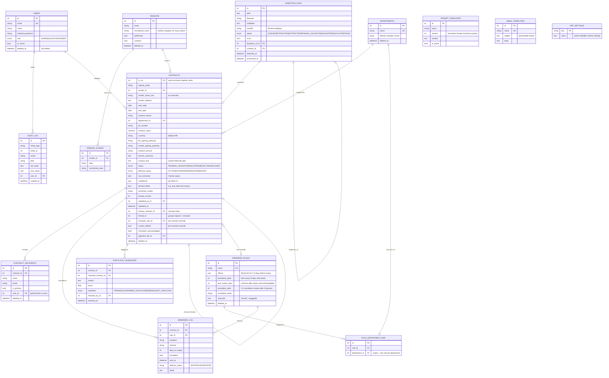

# CMS Database Schema / ERD

All timestamps are stored in **UTC**; scheduling and date display use **Asia/Kolkata**.
Destructive actions are **soft deletes** (`deleted_at`). Every change is written to `audit_log`.

## Rule resolution order (reminders)

1. `contracts.custom_offsets` (per-contract offset override)
2. `contracts.reminder_rule_id` (per-contract rule override)
3. `rule_department_map` → the contract's department's rule
4. No rule → no reminders

## Renewal chains

`thread_id` groups an original contract with all its renewals; `renews_contract_id`
points at the immediate predecessor, so chains render as
`original → renewal → renewal`. Marking a contract RENEWED/TERMINATED stops its
pending reminders automatically (the daily run skips those lifecycle states).
